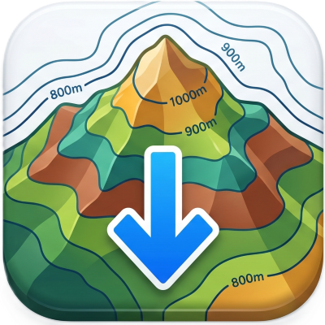
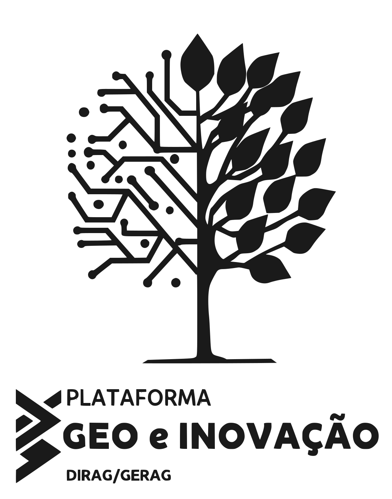

# Fluxo Topográfico

  
  

> Plugin de processamento QGIS para processamento e streaming de dados do MDE ANADEM v1 (30 m, Brasil) via vsicurl.

---

## Visão Geral

O **Fluxo Topográfico** é um algoritmo de processamento (`QgsProcessingAlgorithm`) que automatiza todo o fluxo de trabalho com o MDE ANADEM v1 — da identificação de tiles até a simbologia cartográfica final — para qualquer área de interesse (AOI) no território brasileiro.

Em vez de baixar tiles completos de centenas de megabytes, o plugin faz **streaming seletivo via HTTP range requests** (COG/vsicurl), lendo apenas a sub-região que intersecta a AOI.

---

## Funcionalidades

### Aquisição de Dados
- **Streaming via vsicurl** — requisições HTTP por intervalo (range requests) no driver `/vsicurl/` do GDAL; baixa somente o recorte da AOI, não o tile inteiro.
- **Indexação MGRS local** — varredura espacial 100% offline usando `assets/anadem_mgrs/mgrs.shp`; sem consulta à internet para descoberta de tiles.
- **Cache em disco** — sub-recortes gerados são reutilizados em execuções subsequentes na mesma região.

### Processamento
- **Reprojeção UTM automática** — calcula o centróide da AOI, detecta o fuso UTM SIRGAS 2000 correspondente e reprojeta por interpolação bilinear antes de processar os derivativos topográficos.
- **Suavização TPI-ponderada** — mitiga o efeito serrilhado nas curvas de nível usando o Topographic Position Index acoplado a filtros Gaussianos (kernels 3×3, 7×7 ou 13×13). Áreas planas recebem maior suavização; cristas e vales preservam suas feições estruturais.
- **Cálculo de Declividade** — calcula dinamicamente a declividade do terreno com base nas unidades métricas do raster UTM utilizando o algoritmo `gdaldem slope` integrado.

### Simbologia Automática
- **MDE hipsométrico** — rampa de cores gerada dinamicamente com base nas estatísticas reais de elevação do recorte + overlay Hillshade em modo de mistura *Multiply*.
- **Curvas de nível** — renderização por regras com distinção automática entre curvas mestras (0,50 mm + rótulos a cada 5 intervalos) e normais (0,25 mm); rótulos com máscara de buffer para legibilidade cartográfica.
- **Declividade temática** — aplicação de simbologia temática discreta e contínua baseada em padrões ambientais reconhecidos: FAO (%), Embrapa (%) e CAR (graus, destacando áreas de APP &gt; 45°).

---

## Parâmetros

| Parâmetro | Tipo | Descrição |
|---|---|---|
| **Área de Interesse** | Extent | Delimitação retangular da AOI (máximo: 10.000 km² por execução). |
| **Saída desejada** | Enum | `MDE`, `Curvas de Nível` ou `MDE + Curvas de Nível`. |
| **Adicionar overlay de Hillshade** | Boolean | Computa e sobrepõe o sombreamento analítico sobre o MDE hipsométrico. |
| **Intervalo entre curvas (m)** | Integer | Equidistância vertical em metros (padrão: 10 m; mín: 1 m; máx: 1.000 m). |
| **Nível de suavização** | Enum | `Nenhum` · `Baixo` (3×3) · `Médio` (7×7) · `Alto` (Gaussiano 13×13). |
| **Cor das curvas de nível** | Color | Paleta aplicada às linhas vetoriais e rótulos cartográficos. |
| **Reprojetar projeto para UTM** | Boolean | Altera o CRS do projeto QGIS para o EPSG UTM métrico detectado. |
| **Autenticação de Proxy** | AuthConfig | Credenciais do gerenciador de autenticação QGIS para redes corporativas. |
| **Criar raster de declividade** | Boolean | Computa e gera o raster de declividade a partir do MDE baixado. |
| **Simbologia e unidade da declividade** | Enum | Classificação aplicada ao raster de declividade: `Sem estilo`, `Declividade FAO (%)`, `Declividade Embrapa (%)` ou `Declividade CAR (°)`. |

---

## Instalação

1. Acesse **Releases** neste repositório e baixe o arquivo `.zip` da versão mais recente.
2. No QGIS, vá em **Complementos → Gerenciar e Instalar Complementos**.
3. Escolha **Instalar a partir de ZIP**, aponte para o arquivo baixado e confirme.
4. O algoritmo ficará disponível em:
   - **Caixa de Ferramentas de Processamento** → grupo *Fluxo Topográfico*
   - **Complementos → Ferramentas Geo → Fluxo Topográfico**

> **Requisitos:** QGIS ≥ 3.16 · GDAL com suporte a vsicurl (instalação padrão OSGeo4W)

---

## Sobre o ANADEM

O **ANADEM** (*A Digital Terrain Model for South America*) é um MDE bare-earth de 30 m de resolução para toda a América do Sul.

Diferente de modelos globais convencionais como SRTM e AW3D30 — cujas elevações sofrem viés sistemático pelo dossel vegetal — o ANADEM representa a superfície real do solo. Foi desenvolvido a partir do reprocessamento do **Copernicus DEM GLO-30**, com calibração por aprendizado de máquina usando dados altimétricos LiDAR do sensor **GEDI** e reflectância multiespectral do **Landsat-8**.

O produto é resultado de cooperação científica entre o **IPH/UFRGS** e a **ANA** (TED-05/2019-ANA).

---

## Citação

Ao utilizar dados gerados por este plugin em trabalhos acadêmicos ou laudos técnicos, cite a publicação oficial:

**Artigo principal:**
> Laipelt, L.; de Andrade, B.C.C.; Collischonn, W.; Amorim, A.; Paiva, R.C.D.; Ruhoff, A. (2024).
> ANADEM: A digital terrain model for South America.
> *Remote Sensing*, 16(13), 2321.
> https://doi.org/10.3390/rs16132321

**Trabalho técnico:**
> Laipelt, L.; de Andrade, B.C.C.; Reichert, F.C.; Amorim, A.; da Silva, A.H.; Ruhoff, A. (2023).
> Proposta de correção do viés da vegetação para elaboração de um modelo digital de terreno em escala continental.
> *XXV Simpósio Brasileiro de Recursos Hídricos*, ABRHidro.

---

## Licença

Distribuído sob a licença **MIT**. Consulte o arquivo `LICENSE` para detalhes.

---

* **Equipe de Desenvolvimento:** [Clayton Igarashi](mailto:geoigarashi@gmail.com) & [Plat. Geo e Inovação](https://github.com/geoigarashi)
